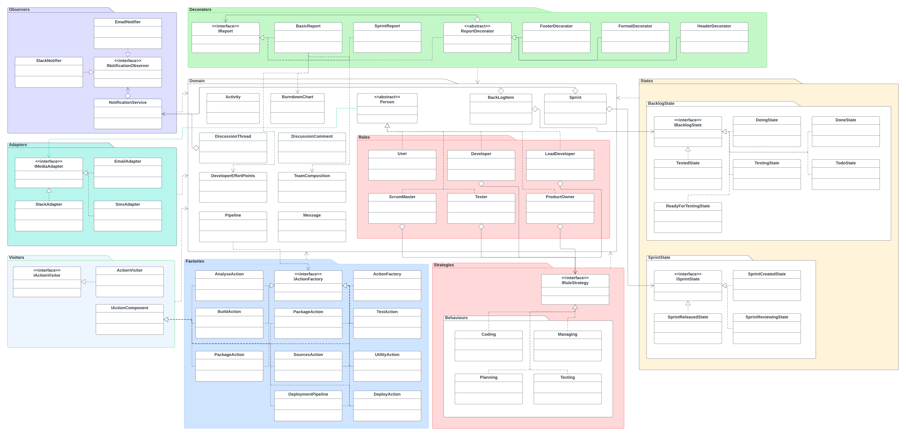

# Project: Scrum/DevOps Project Management System

This project aims to develop a domain for a Scrum/DevOps project management system akin to Azure DevOps or Atlassian Jira. The focus is on utilizing various design patterns in C# to adhere to object-oriented design principles. The project emphasizes the implementation of at least six design patterns, including one creational pattern and a minimum of four different structural/behavioral patterns.

## Functional and Non-functional Requirements:
- **Functional Requirements:**
  - Project management functionalities following Scrum methodology.
  - Support for managing product backlogs, sprints, and backlog items.
  - Integration of development pipelines for build, test, analysis, and deployment.
  - Discussion forum for collaborative communication.
  - Reporting capabilities for sprint summaries, team compositions, etc.

- **Non-functional Requirements:**
  - Quality Gate label A assessment using SonarCloud for code quality.
  - Integration with version control systems like Git for software configuration management.
  - Automated testing with mock implementations for external services like email notifications and Slack messages.

## Design Patterns Utilized:
- **Creational Pattern:**
  - Factory pattern

- **Structural/Behavioral Patterns:**
  1. Strategy pattern
  2. State pattern
  3. Observer pattern
  4. Adapter pattern
  5. Decorator pattern

## Package Diagram:

## Code Implementation:
The project is implemented in C#, with explicit indication of the design patterns used within the codebase.

## Testing Approach:
Unit tests are implemented to validate the domain logic based on use cases and user stories. Focus is placed on testing complex logic and business rules rather than trivial getters and setters.

## Deployment:
The project includes a DevOps environment incorporating source-code management and development pipelines for building, testing, and static code analysis.

For further details, refer to the provided documentation and codebase.

**Note:** This README serves as a concise overview. Refer to the comprehensive documentation for detailed insights and analysis.
